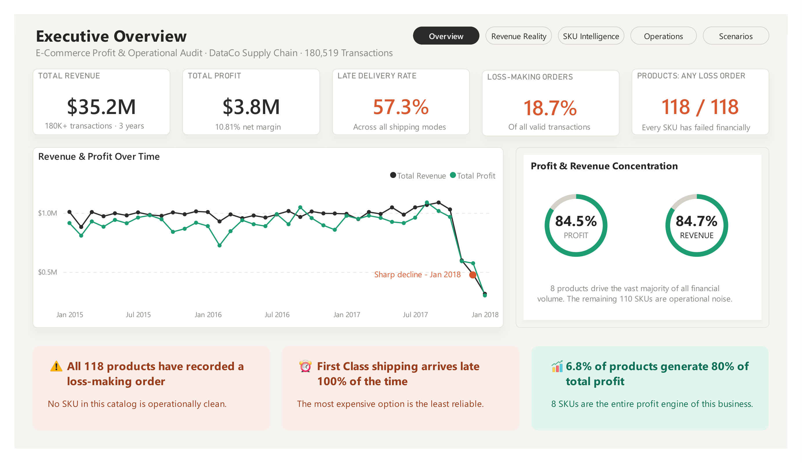
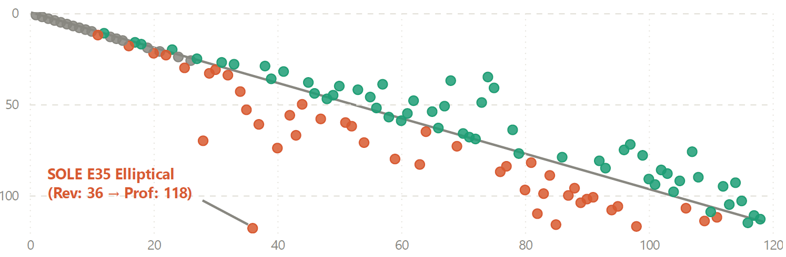
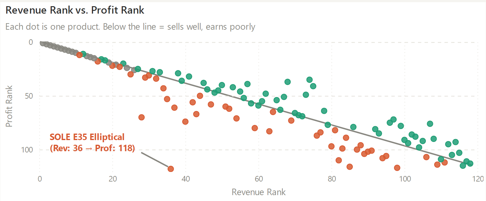
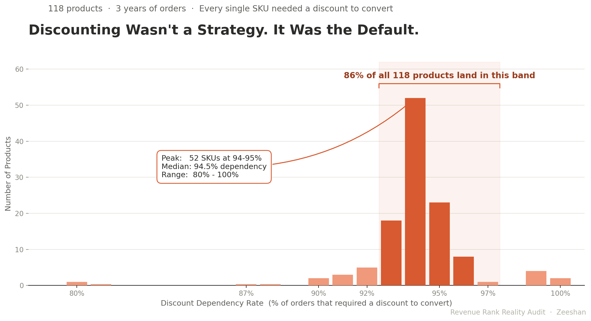
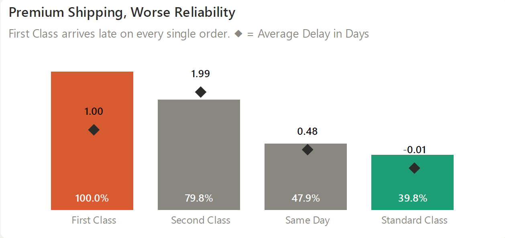
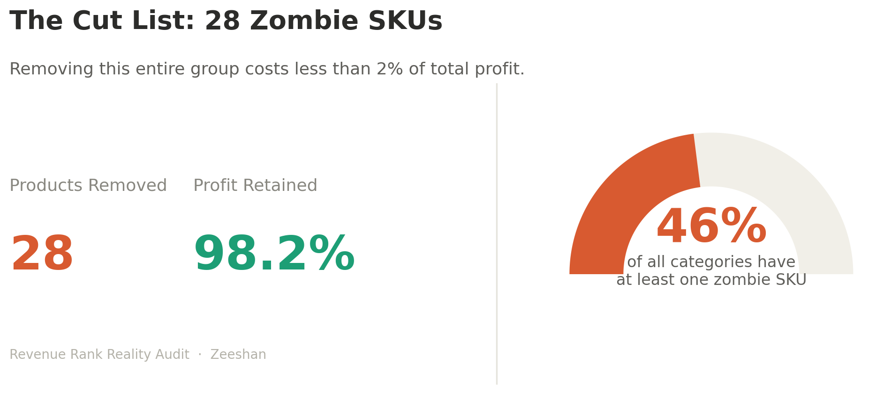
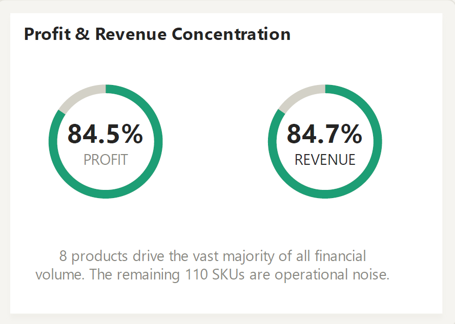
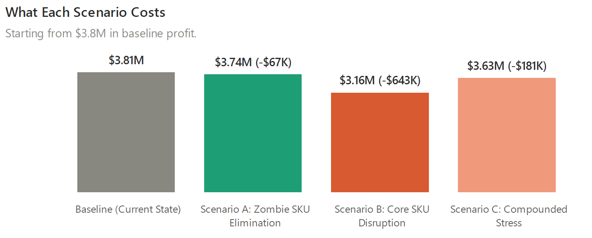

# The Profit Leak Diagnostic
### How 28 Products Are Bleeding $643K Out of a $35M Catalog

**An audit-grade profitability and operational risk framework for D2C brands and Shopify operators whose revenue is growing while margins quietly shrink.**

[](reports/The_Profit_Leak_Diagnostic.pdf) 
[](https://youtu.be/BtNOyrPLW7o) 
[](https://calendly.com/zeeshanakram/data-diagnostic)

---

## The Verdict

This catalog generates $35.2M in revenue across 180,519 transactions. On paper, that looks like a healthy business.

It isn't. Every single one of its 118 products has recorded at least one loss-making order. Just 8 products generate 84.5% of all profit. 28 products sit in the catalog doing nothing but consuming warehouse space and customer service hours. For nearly three years, revenue and profit moved sideways, then collapsed off a cliff in the same month, which is what happens when a fragile supply chain finally runs out of room to absorb its own problems.

Revenue is not the issue. Mistaking revenue for business health is.

This repository is the full technical build behind that finding: the SQL warehouse, the statistical validation, the scenario models, and the dashboard all reproducible, all traceable back to ground-truth queries, none of it a guess dressed up as a conclusion.

---

## See It In Action

| Dashboard | Report |
|---|---|
|  |  |

🎥 **[Watch the full dashboard walkthrough →](https://youtu.be/BtNOyrPLW7o)** <br>
📄 **[Read the 9-page client report →](reports/The_Profit_Leak_Diagnostic.pdf)**

*(More dashboard pages and report figures are in `assets/dashboard_screenshots/` and `assets/report_figures/`.)*

---

## What the Audit Found

### The Revenue Trap
44 products show strong revenue and weak or negative profit at the same time. The SOLE E35 Elliptical ranks 36th out of 118 by revenue and dead last in profit. Two products (SOLE E35, SOLE E25) are net-negative across their *entire three-year history*, not just on a bad day.



### The Discounting Illusion
93–97% of orders across nearly the entire catalog require a discount to convert. That's not a seasonal push, it's the default operating model. Statistical testing confirms zero correlation between discount depth and margin erosion (p = 0.73), so there's no pricing lever waiting to be pulled. Even the top 4 revenue products need a discount on 94.4% of their orders, and 18.5% of those orders still lose money outright.



### The Cost of Premium Shipping
First Class shipping arrives late **100% of the time**, averaging a full day behind schedule. Standard Class, the cheapest tier is the most reliable method in the catalog. Customers paying the most for speed are getting the worst experience the business offers.



### 28 Zombie SKUs
28 products combine weak margins with high delivery failure while generating just 2.2% of total revenue, spread across 23 different categories not one bad supplier, but scattered drag across nearly half the catalog's taxonomy. Cutting all 28 retains 97.8% of revenue and 98.2% of profit, for a cost of roughly $67K and a quarter of operational bandwidth freed immediately.



### The 8 Products Running the Business
8 products out of 118 generate 84.5% of all profit, a single point of failure wearing a 118-product disguise. A 20% margin shock to just those 8 (a plausible supplier or logistics disruption) wipes out **$643,000**, nearly 17% of total company profit, in one move. The other 110 products cannot absorb that loss between them.



### What Happens If Nothing Changes
Three scenarios were modeled against this catalog to quantify the cost of inaction, run end-to-end in `notebooks/04_scenario_simulation.ipynb`:

| Scenario | Action | Financial Impact |
|---|---|---|
| **A: Zombie SKU Elimination** | Cut all 28 Cut Candidates | –$67K profit, frees ~25% of operational bandwidth |
| **B: Core SKU Disruption** | 20% margin shock to the top 8 SKUs | –$643K profit (16.9% of total) |
| **C: Compounded Operational Stress** | +10% discount dependency, +15% delivery risk | –$181K profit (directional estimate) |



---

## The Analytical Deliverables

This isn't a set of charts, it's a decision engine built from three layers:

1. **SKU Quadrant Classification**: every product mapped into one of four operational quadrants (*Cash Generators, Operational Risks, Underperformers, Cut Candidates*) using catalog medians, not arbitrary thresholds.
2. **Revenue Trap Detection**: products with high revenue rank but low/negative profit rank, surfaced through rank-divergence analysis.
3. **Composite Risk Score (0–100)**: a normalized, equally-weighted blend of delivery failure, discount dependency, and rank divergence per SKU. Statistically validated as a predictor of margin collapse (r = -0.57, p < 0.001) where no single metric alone is predictive.

Every finding above is tagged by evidence strength, **Confirmed Evidence** (p < 0.05), **Directional Signal** (0.05 ≤ p < 0.10), or **Observation**, so nothing is presented with more certainty than the data supports.

---

## Methodology & Architecture

Built as a strict, reproducible three-phase pipeline not a single notebook with a chart at the end.

**Phase 1: Data Engineering & Ground Truth (PostgreSQL)** <br>
Raw transactional data mapped into a 4-table star schema (`fact_orders`, `dim_product`, `dim_region`, `dim_date`). SQL is the *only* source of ground-truth KPIs revenue, net profit %, delivery risk rate per product and category. Fraudulent and canceled orders are excluded by a hard filter; every inclusion/exclusion decision (pending payments, low-volume products, extreme-loss records) is logged and justified in `docs/decision_log.md`.

**Phase 2: Validation & Quadrant Modeling (Python / Pandas)** <br>
SQL outputs reconciled in Python to confirm 0% data loss. Distributional analysis exposed extreme right-skew across revenue and profit, which directly shaped every modeling decision downstream medians over means, non-parametric tests over parametric ones.

**Phase 3: Statistical Proof (SciPy)** <br>
Shapiro-Wilk confirmed non-normality across all key metrics, so the audit relies on Spearman rank correlation, Kruskal-Wallis H-tests, Mann-Whitney U, and IQR outlier detection throughout rank-based methods that don't assume a bell curve that the data doesn't have. Quadrant separation alone is confirmed by Kruskal-Wallis at p = 4.43e-19 for margin and p = 5.47e-19 for delivery risk.

**Phase 4: Scenario Simulation** <br>
Validated findings converted into dollar-denominated business consequences (see scenario table above), so the recommendations aren't just "this SKU is risky" but "this SKU costs you $X if you do nothing."

Full reasoning for every modeling choice like quadrant axis selection, risk score weighting, alpha thresholds, scenario assumptions is documented in [`docs/decision_log.md`](docs/decision_log.md).

---

## Project Structure

```text
├── assets/
│   ├── dashboard_screenshots/    # Power BI dashboard pages + walkthrough video
│   ├── linkedin_assets/          # Carousel and launch visuals
│   └── report_figures/           # Chart figures used in the client report
│
├── data/
│   ├── raw/                      # Raw transaction exports (not tracked in Git)
│   ├── processed/                # Cleaned SQL outputs
│   ├── sample/                   # Sample data
│   └── export/                   # Final exported CSVs / Excel
│
├── docs/                         # Decision log, KPI framework, methodology, assumptions (13 files)
│
├── notebooks/
│   ├── 01_validation_and_eda.ipynb          # Distribution and temporal trend analysis
│   ├── 02_profitability_analysis.ipynb      # Quadrant modeling and Pareto analysis
│   ├── 03_statistical_validation.ipynb      # Non-parametric hypothesis testing
│   └── 04_scenario_simulation.ipynb         # Validated findings converted to financial impact
│
├── powerbi/
│   ├── dashboard/                # Power BI project (.pbip) full multi-page dashboard
│   └── theme.json                # Custom "Revenue Rank Reality" color theme & typography
│
├── reports/
│   ├── profit_leak_diagnostic.md            # Client-facing diagnostic (source)
│   └── The_Profit_Leak_Diagnostic.pdf        # Client-facing diagnostic (final, 9 pages)
│
├── sql/
│   ├── 01_raw_import/            # DDL for raw data
│   ├── 02_schema_setup/          # Dimensional model creation
│   ├── 03_quality_audit/         # Integrity and null checks
│   ├── 04_dimension_builds/      # Dim tables (Product, Region, Date)
│   ├── 05_fact_builds/           # Fact table (Orders)
│   ├── 06_validation/            # Foreign key and grain tests
│   └── 07_kpi_queries/           # Final analytical outputs feeding Python
│
├── src/                          # Environment configs and Python scripts
│
├── requirements.txt
├── .gitignore
├── LICENSE
└── README.md
```

---

## Run This Audit on Your Store

I run this exact diagnostic for e-commerce operators who need to know which SKUs are actually driving growth and which ones are quietly bleeding cash. If decisions in your business are being made off a revenue leaderboard, there's a real chance you're protecting the wrong products and cutting the wrong costs.

The deliverable isn't a generic dashboard, it's specific, statistically defensible interventions: which SKUs to cut, which to protect, and what each path costs you in dollars if you do nothing.

### Get in Touch

- **Email:** [zeeshanakramds@gmail.com](mailto:zeeshanakramds@gmail.com)
- **LinkedIn:** [linkedin.com/in/zeeshan-akram-ds](https://www.linkedin.com/in/zeeshan-akram-ds/)
- **Portfolio / Case Studies:** [Personal Website](https://zeeshan-portfolio-swart.vercel.app/)
- **Book a 15–20 min Diagnostic Call:** [calendly.com/zeeshanakram/data-diagnostic](https://calendly.com/zeeshanakram/data-diagnostic)

---

*Licensed under the terms in [LICENSE](LICENSE).*